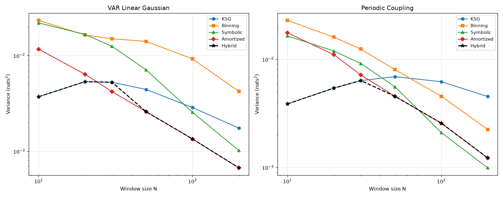
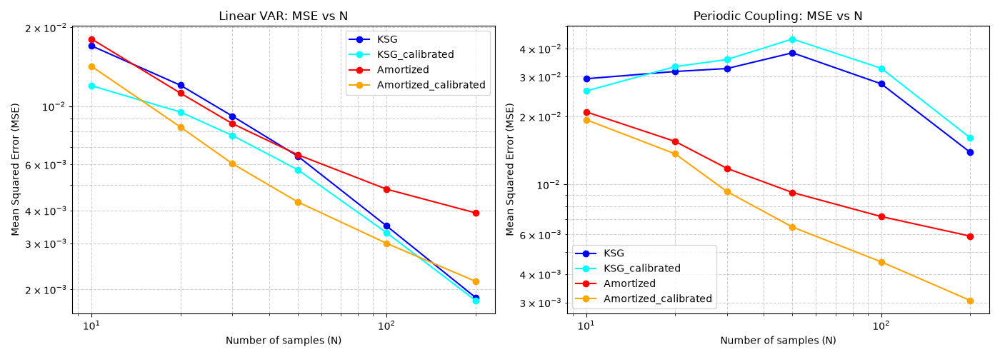
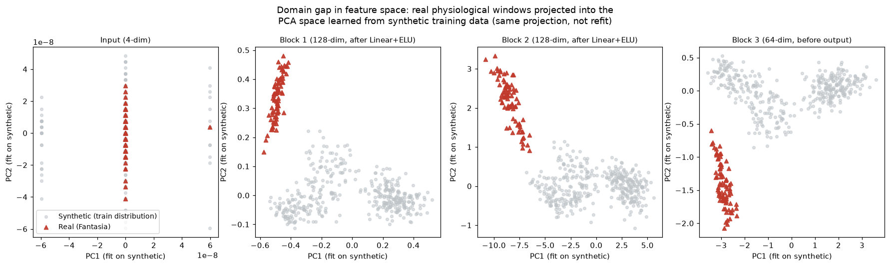
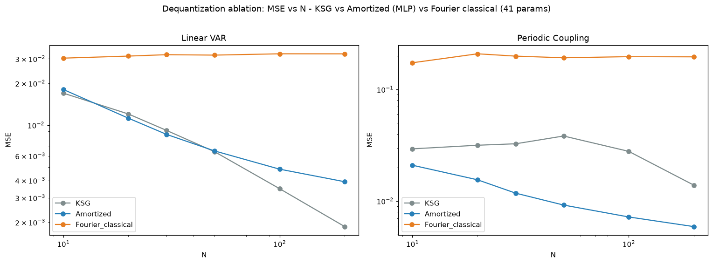

# Báo cáo tổng hợp tiến độ gửi Thầy/Cô hướng dẫn

**Người viết:** [Tên sinh viên] — **Đề tài:** Ước lượng transfer entropy (TE) bằng mạng học sẵn (amortized MINE) cho tín hiệu sinh lý ngắn, và thử nghiệm mạch lượng tử thay thế mạng cổ điển.

---

## 1. Tóm tắt trong một đoạn

Em đã hoàn thành phần thực nghiệm chính. Trên dữ liệu mô phỏng có đáp án, mạng học sẵn cho phương sai thấp hơn các phương pháp cổ điển (KSG, binning, symbolic) từ kích thước cửa sổ N≈30 (dữ liệu tuyến tính) hoặc N≈50 (dữ liệu phi tuyến). Trên dữ liệu tim–hô hấp thật (23 bản ghi từ 2 nguồn độc lập), phương pháp KSG xác nhận chiều hô hấp→tim chiếm ưu thế có ý nghĩa thống kê, nhưng **mạng học sẵn thất bại trên dữ liệu thật** do lệch miền dữ liệu; em đã chẩn đoán nguyên nhân bằng phân tích không gian đặc trưng. Em cũng thử thay mạng bằng mạch lượng tử: mạch học được nhưng **không thắng** mạng cổ điển. Em đánh giá bài hiện ở mức nộp được tạp chí Q2; để hướng tới Q1 cần giải quyết điểm yếu lớn nhất là mạng học sẵn chưa có kết quả dương trên dữ liệu thật (mục 6–7, kế hoạch chi tiết ở `KE_HOACH_NANG_CAP_Q1.md`).

## 2. Câu hỏi nghiên cứu

Các estimator TE cổ điển cần N đủ lớn để ổn định, trong khi tín hiệu sinh lý thường chỉ có cửa sổ ngắn (10–200 mẫu). Liệu một mạng học sẵn một lần có thay thế được chúng ở vùng N nhỏ, và kết luận đó có còn đúng trên dữ liệu sinh lý thật?

## 3. Những gì đã làm

| Giai đoạn | Nội dung | Trạng thái |
|---|---|---|
| P | Bộ sinh dữ liệu mô phỏng có TE thật (VAR tuyến tính, phi tuyến, periodic) + 3 baseline (KSG, binning, symbolic) | Xong; sửa 1 lỗi công thức TE thật, xác minh 3 nguồn độc lập |
| Q | Mạng MINE cổ điển, sai số MI 7.6% (ngưỡng 20%) | Xong; phát hiện thiên lệch chọn epoch |
| R, R2 | Mạng học sẵn trên 27.000 cửa sổ mô phỏng, quét N, nhiễu, ghép nối; thêm dữ liệu periodic | Xong; sửa lỗi lệch chỉ số nghiêm trọng trong bước đánh giá |
| S | Dữ liệu thật Fantasia + Apnea-ECG, kiểm định theo bản ghi | Xong; loại tim–não do nhiễu điện tim không khử được |
| T | Estimator kết hợp (Hybrid), hiệu chỉnh độ lệch, chẩn đoán PCA | Xong |
| P′–Q′ | Mô hình Fourier đối chứng + mạch lượng tử 6 qubit | Xong; kết luận: học được, không thắng |

Toàn bộ 113 test tự động của dự án đều pass. Đến nay em đã tìm và sửa hơn 20 lỗi, trong đó nhiều lỗi tinh vi (lệch chỉ số, pseudo-replication, thiên lệch chọn epoch, lỗi tách rời cộng tính).

## 4. Kết quả chính

**4.1. Dữ liệu mô phỏng — điểm giao cắt giữa cổ điển và học sẵn.** Mạng học sẵn thắng về phương sai từ N≈30 (tuyến tính) và N≈50 (periodic). Ở N nhỏ hơn, KSG vẫn tốt hơn. Vì ngưỡng phụ thuộc loại dữ liệu và dữ liệu thật không biết trước loại, em xây estimator Hybrid với ngưỡng chung an toàn N=50.

**4.2. Hiệu chỉnh độ lệch.** Mạng học sẵn có độ lệch gần cố định theo N. Hiệu chỉnh bằng leave-one-config-out (không dùng chính cấu hình đang đánh giá) giúp nó thắng cả MSE: trên dữ liệu tuyến tính ở N=20–100, trên dữ liệu periodic ở mọi N, kể cả khi hiệu chỉnh KSG cùng cách để so sánh công bằng. Kết quả này chỉ trên dữ liệu mô phỏng.

**4.3. Dữ liệu tim–hô hấp thật (KSG, 23 bản ghi, kiểm định theo bản ghi):**

| TE(hô hấp→tim) | TE(tim→hô hấp) | CI 95% hiệu số | Wilcoxon p |
|---|---|---|---|
| 0.1175 nats | 0.0996 nats | [0.0057, 0.0311] | 0.0046 |

Đúng chiều RSA đã biết. Chiều dương ở cả 9/9 tổ hợp tham số kiểm tra độ nhạy, ý nghĩa thống kê ở 5/9.

**4.4. Mạng học sẵn thất bại trên dữ liệu thật.** Mạng chưa hiệu chỉnh cho TE hô hấp→tim = −0.247 (âm, sai hướng). Chiếu dữ liệu thật vào không gian đặc trưng đã học từ dữ liệu mô phỏng cho thấy dữ liệu thật nằm hoàn toàn ngoài vùng dữ liệu huấn luyện ở mọi lớp — đây là nguyên nhân hình học của thất bại.

**4.5. Mạch lượng tử (N=20, ghép nối 0.6, TE thật 0.181, 100 cửa sổ kiểm tra độc lập):**

| | Độ lệch | Phương sai | MSE |
|---|---|---|---|
| KSG | −0.083 | 0.0063 | 0.0132 |
| Mạng cổ điển (MLP) | −0.072 | 0.0049 | **0.0100** |
| Mạch lượng tử (sau chỉnh mask) | −0.033 | 0.0115 | 0.0125 |

Mạch học được (loss hội tụ, đặc trưng tách theo cường độ ghép nối) nhưng phương sai cao hơn MLP. Phân rã TE thành hai thành phần cho thấy hai nhánh tính toán của mạch ít tương quan hơn MLP (0.79 so với 0.89) và một thành phần nhiễu hơn. Độ lệch thấp của mạch một phần là do hai sai số triệt tiêu nhau, không phải chính xác hơn. Mô phỏng CPU tốn 1–1,5 giờ cho một lần huấn luyện nhỏ nên không mở rộng được. Trước đó, mô hình Fourier cổ điển 41 tham số thua cả KSG và MLP; qua đó em phát hiện và chứng minh bằng bất đẳng thức Jensen rằng hàm thống kê tách rời cộng tính luôn cho chặn dưới Donsker–Varadhan ≤ 0 — bài học áp dụng cho cả thiết kế mạch lượng tử.

## 5. Vị trí so với nghiên cứu khác

Em đã đọc phần thực nghiệm của hai bài gần nhất, đều đã công bố có bình duyệt: **TREET** (IEEE Access, Transformer, có thử trên dữ liệu Apnea) và **TENDE** (AISTATS 2026, diffusion model). Điểm khác biệt xác nhận được: cả hai chỉ test ở vùng mẫu lớn (T từ 500 đến 50.000), không đo vùng N=10–200 mà đề tài tập trung. Trên dữ liệu tim–hô hấp thật, cả ba nghiên cứu cùng hướng (hô hấp→tim chiếm ưu thế). Em chưa so sánh số-với-số trực tiếp với hai bài này (khác dữ liệu, khác cỡ mẫu).

## 6. Đánh giá trung thực về mức sẵn sàng

**Điểm mạnh:** khoảng trống ở vùng N nhỏ đã xác nhận; quy tắc chọn phương pháp theo N và loại động lực học; công cụ chẩn đoán domain gap; thống kê đúng đơn vị mẫu; báo cáo trung thực cả thất bại kèm nguyên nhân.

**Điểm yếu (em nghĩ reviewer Q1 sẽ hỏi):**
1. Kết quả dương trên dữ liệu thật là của KSG (phương pháp đã có); mạng học sẵn fail trên dữ liệu thật.
2. Hiệu chỉnh độ lệch mới chỉ chạy trên dữ liệu mô phỏng.
3. Chỉ dùng trễ 1 bước; dữ liệu mô phỏng mới có VAR tuyến tính và một dạng periodic.
4. Chưa so sánh trực diện với TREET/TENDE.
5. Phần lượng tử là kết quả âm, ở quy mô nhỏ (1 cấu hình, 1 seed).

Với hiện trạng, em cho rằng bài phù hợp định vị "benchmark ở N nhỏ + chẩn đoán domain gap" và nhắm tạp chí Q2 (Entropy, Frontiers in Network Physiology).

## 7. Đề xuất hướng tiếp theo

Để hướng tới Q1, em đề xuất tập trung vào điểm yếu số 1: sửa domain gap để mạng học sẵn cho kết quả đúng trên dữ liệu thật (chặn dưới DV không cần nhãn nên có thể thích nghi trên tín hiệu thật, đánh giá trên bản ghi giữ lại), kèm chính thức hoá phần toán học và so sánh trực diện với TREET/TENDE. Kế hoạch chi tiết, thời gian, rủi ro và các điểm dừng quyết định ở `KE_HOACH_NANG_CAP_Q1.md`. Em dừng đầu tư thêm vào lượng tử và đưa phần này vào bản thảo như kết quả bổ sung.

## 8. Em cần ý kiến của Thầy/Cô

1. Định vị bài: nộp Q2 với nội dung hiện có, hay đầu tư 8–10 tuần để thử hướng Q1?
2. Nếu thử Q1: Thầy/Cô ưu tiên hướng sửa domain gap, hay hướng câu hỏi lâm sàng (khác biệt TE giữa nhóm)?
3. Phần lượng tử: trình bày như phụ lục kết quả âm có được không, hay Thầy/Cô muốn em thử thêm?
4. Có tạp chí cụ thể Thầy/Cô muốn em nhắm tới để định dạng bản thảo từ sớm?
