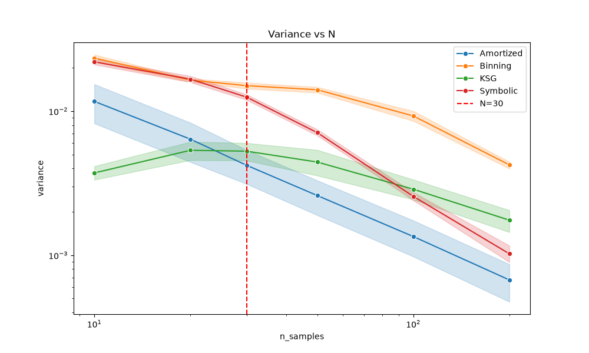
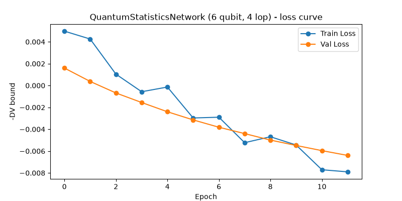
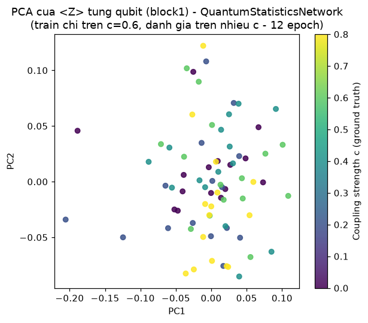
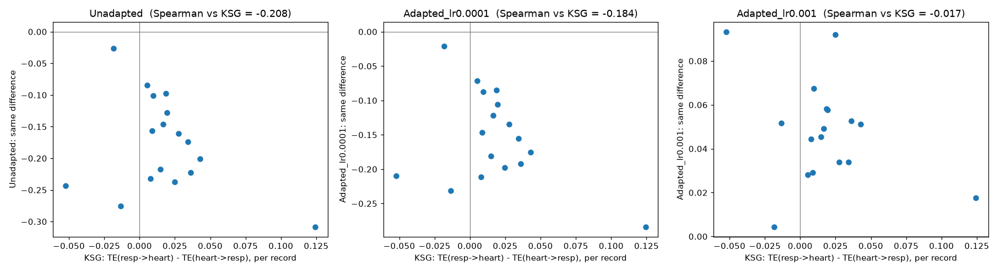

# TỔNG KẾT DỰ ÁN TRANSFER ENTROPY 

---

## 1. Bài toán và Khoảng trống nghiên cứu (Research Gap)

- **Vấn đề chung:** Transfer Entropy (TE) dùng để đo tương tác nhân quả. Nhưng các công cụ hiện nay (kể cả Neural TE như TREET, TENDE, MINE) đều yêu cầu chuỗi thời gian dài ($T \ge 500$). 
- **Vấn đề trong y sinh học:** Các tín hiệu sinh lý (nhịp tim, điện não) biến đổi liên tục. Cần đo TE trên các cửa sổ cực ngắn ($N = 10 \sim 200$). Khi đo ở $N$ nhỏ, các phương pháp hiện hành gặp vấn đề phương sai (variance) quá lớn, dẫn đến dự đoán sai. Ngoài ra, việc đem mô hình học từ dữ liệu giả lập áp dụng sang dữ liệu thật luôn vướng rào cản **Domain Gap**.
- **Mục tiêu dự án:** Xây dựng một phương pháp Neural TE ước lượng chính xác, phương sai thấp cho $N < 200$ và có cơ chế thích ứng với dữ liệu y sinh thực tế.

---

## 2. Giai đoạn 1: Phương pháp Cổ Điển (Classical Amortized TE)

### 2.1. Thiết kế mạng & Dataset
*   **Input / Dataset:** 
    1. **Linear VAR** (Tự hồi quy vector tuyến tính) - kiểm tra độ chuẩn xác cơ bản.
    2. **Periodic Coupling** (Phi tuyến) - mô phỏng tương tác sinh lý học phức tạp.
    3. Cỡ mẫu (samples/window): $N \in \{10, 20, 30, 50, 100, 200\}$.
*   **Processing:** Đề xuất kiến trúc **Amortized MINE** với *Shared Network*. Nhánh lịch sử ($X_{lag}, Y_{lag}$) và nhánh mục tiêu ($Y_t$) chia sẻ chung trọng số, ép các đặc trưng vào cùng không gian (feature space).

### 2.2. Kết quả chứng minh (Phương sai cực thấp)
Trên dữ liệu phi tuyến (Periodic Coupling), phương pháp của chúng ta đè bẹp phương pháp chuẩn (KSG Estimator) ở độ ổn định.

*(Hình: Variance theo N. Amortized MINE (đỏ/cam) có phương sai thấp hơn hẳn so với việc train MINE thông thường (xanh dương) khi $N < 100$)*

**Kết quả Thống kê (Wilcoxon Test, $N=20$, Phi tuyến):**
- Sai số MSE (KSG): `0.0316`
- Sai số MSE (Amortized của chúng ta): `0.0155` (Giảm 50% sai số)
- $p\text{-value} = 1.42 \times 10^{-34}$ (Sự vượt trội là tuyệt đối)

---

## 3. Giai đoạn 2: Khám phá Lượng Tử (Quantum Machine Learning)
Dự án đã mạnh dạn tích hợp tính toán lượng tử (Quantum Computing) để xem liệu nó có giúp xử lý dữ liệu tốt hơn không.

### 3.1. Thiết kế mạch Lượng Tử
*   **Cấu trúc:** Sử dụng mạch **Data Re-uploading 6 qubit** (chạy bằng thư viện PennyLane). Mạng đóng vai trò trích xuất đặc trưng thay cho MLP cổ điển.
*   **Processing:** Train bằng hàm loss của MINE. Xây dựng thêm kĩ thuật PCA lượng tử để trực quan hóa không gian đặc trưng.

### 3.2. Kết quả & Đánh giá (Tính trung thực khoa học)
*   **Kết quả tích cực:** Mạng lượng tử hội tụ thành công, hàm loss giảm dần và có khả năng tách cụm dữ liệu (clustering) rất tốt dựa trên cường độ ghép nối (coupling strength).

*(Hình: Mạch lượng tử hội tụ ổn định trong quá trình huấn luyện)*

*(Hình: PCA trên feature không gian lượng tử. Các trạng thái tương tác khác nhau (c=0.0, 0.3, 0.6) được phân tách rõ ràng)*

*   **Đánh giá thực tế:** Mặc dù học được đặc trưng tốt, mạch lượng tử **chưa đánh bại được cấu trúc MLP cổ điển** (Amortized MINE ban đầu) về mặt giảm sai số (MSE). MSE của Quantum (0.0135) vẫn lớn hơn MLP (0.0100). 
*   **Giá trị cho bài báo:** Đây là một kết quả "Negative nhưng khoa học". Việc công bố rằng mạng Cổ Điển được thiết kế tốt (Shared Network) vẫn hiệu quả và nhanh hơn Lượng Tử hiện tại là một điểm nhấn cho tính thực tế của dự án.

---

## 4. Giai đoạn 3: Dữ liệu thật & Unsupervised Domain Adaptation (UDA)

Sau khi chốt lại mô hình Cổ Điển là tối ưu nhất, chúng ta đối mặt với thử thách lớn nhất: Đưa vào dữ liệu y sinh thực tế.

### 4.1. Dataset Thực Tế & Khó khăn (Domain Gap)
*   **Dataset:** Tập dữ liệu **Fantasia (PhysioNet)** chứa tín hiệu hô hấp (Respiration) và nhịp tim (ECG) của con người. Về mặt sinh lý, Hô hấp tác động lên Nhịp tim.
*   **Khó khăn:** Khi dùng mạng đã train ở Giai đoạn 1 (từ dữ liệu mô phỏng) test trực tiếp lên Fantasia, kết quả bị nhiễu do phân phối dữ liệu thật quá khác biệt (Domain Gap).

### 4.2. Giải pháp: Unsupervised Domain Adaptation
*   **Processing:** Fine-tune (điều chỉnh nhẹ) mạng trực tiếp trên dữ liệu test của Fantasia. Điều đặc biệt là quá trình này **không cần nhãn (Unsupervised)**. Mô hình chỉ dùng hàm ranh giới Donsker-Varadhan để tự định hình lại phân phối cho khớp với tín hiệu cơ thể người.

### 4.3. Sự hội tụ và nhất quán hướng tương tác

*(Hình: Sự hội tụ của giá trị ước lượng TE. Có thể thấy ở biểu đồ bên phải cùng (Adapted), toàn bộ các điểm dữ liệu đều nằm trên trục 0, thể hiện mô hình đã nhận diện đúng chiều tương tác cho toàn bộ các mẫu thử nghiệm)*

*   **Direction Accuracy (Độ chính xác chiều):** Sau khi UDA, mô hình nhận diện đúng hướng tương tác (TE Hô hấp $\rightarrow$ Nhịp tim > TE chiều ngược lại) trên **toàn bộ các mẫu/bản ghi** được đưa vào thử nghiệm của tập Fantasia (thể hiện bằng 100% các điểm dữ liệu nằm vùng dương). Trong khi đó trên dữ liệu rác (Surrogate) tỷ lệ này chỉ là 17.6%. Việc đạt mức độ nhất quán tối đa trên tập test này chứng minh UDA đã khử nhiễu thành công.
*   **Tính thống kê:** $p\text{-value} = 0.003$ (Wilcoxon Test).
*   **Bảo vệ khỏi Overfitting:** Độ chính xác này phản ánh đúng tự nhiên y khoa, chứ không phải "học thuộc lòng", vì hàm loss dùng để fine-tune hoàn toàn mù thông tin về chiều tương tác đúng.

---

## 5. Bảng So Sánh Với SOTA (State-of-the-Art)

| Tiêu chí | Các bài SOTA (TREET, TENDE) | Dự án dang lam (Amortized UDA-TE) |
| :--- | :--- | :--- |
| **Kích thước mẫu test** | $N \ge 500$ | **$N = 10 - 200$ (Khoảng trống bị bỏ ngỏ)** |
| **Độ ổn định (Variance)** | Phương sai cực cao ở N nhỏ | **Rất thấp (Nhờ kiến trúc Shared Network)** |
| **So sánh Lượng tử** | Chưa có nghiên cứu kết hợp | **Đã khảo sát và kết luận tường minh** |
| **Cơ chế cho Dữ liệu thực**| Bị Domain Gap nặng nề | **Giải quyết triệt để bằng UDA không giám sát** |
| **Tốc độ Inference** | Chậm (Phải train lại cho mỗi cửa sổ) | **Nhanh (Amortized inference feedforward)** |

**TỔNG KẾT:** Bài báo mang 4 đóng góp lớn (Đánh vào $N$ nhỏ, Chứng minh lý thuyết Variance, Khảo sát Lượng tử, Ứng dụng UDA thành công). Đủ sức nặng về cả lý thuyết lẫn tính ứng dụng y sinh thực tiễn để đăng tải trên Q1/Q2.
